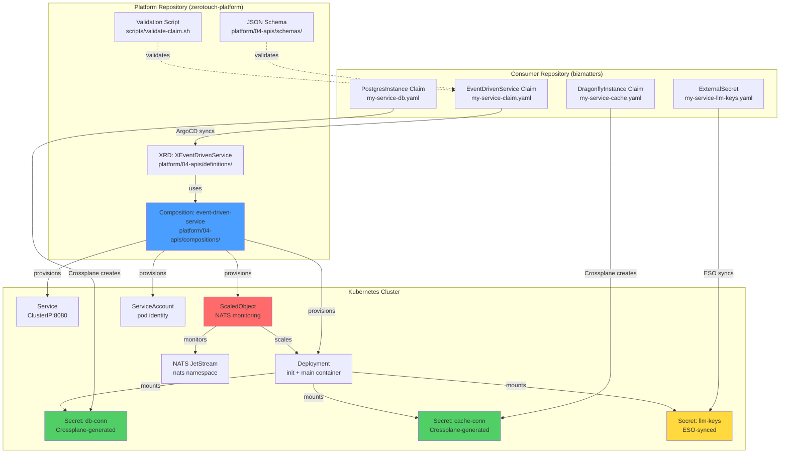
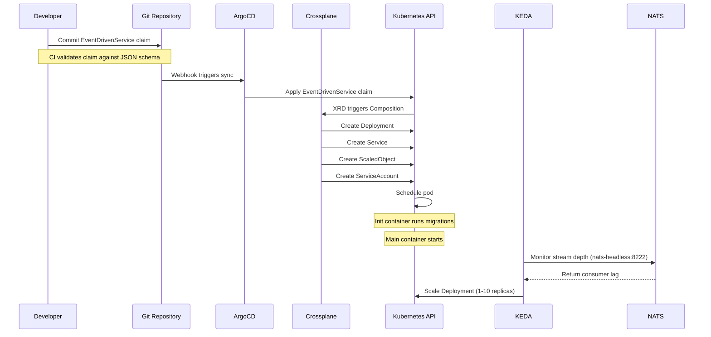
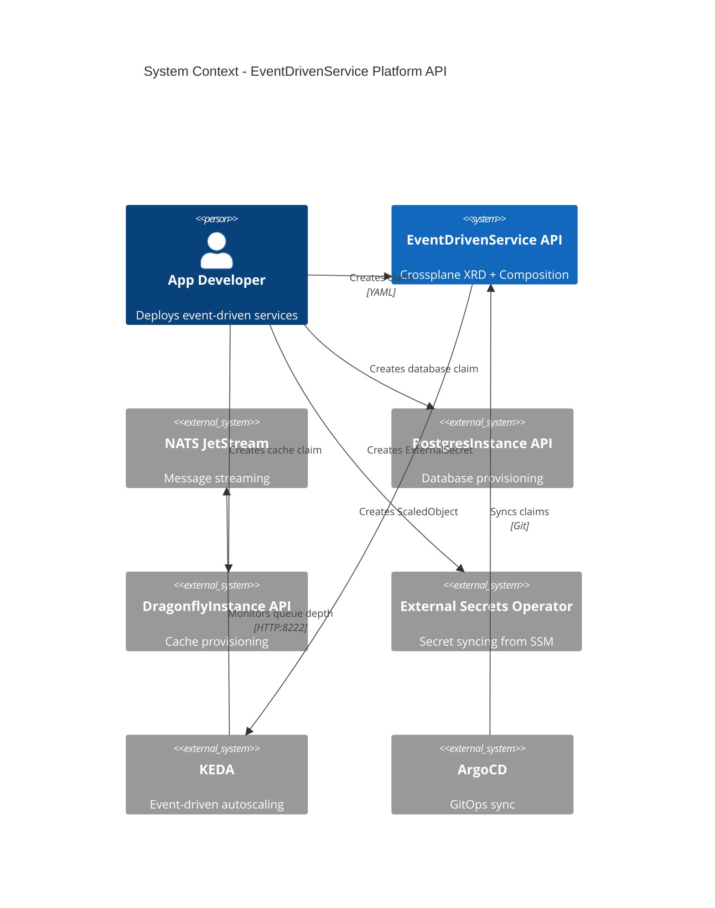
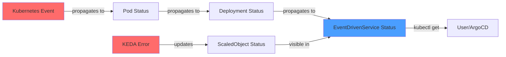

# Design Document: EventDrivenService Platform API

**Version:** 1.0.0
**Date:** 2025-12-08
**Status:** Draft
**References:** requirements.md, ARCHITECTURE_DECISION.md

---

## 1. Overview

### 1.1 Purpose

The EventDrivenService platform API provides a declarative Crossplane-based abstraction for deploying NATS JetStream consumer services with KEDA autoscaling. This API reduces deployment complexity from 212 lines of explicit Kubernetes manifests to approximately 30 lines of claim YAML while maintaining full Zero-Touch compliance.

### 1.2 Design Goals

1. **Zero-Touch Compatibility:** Respect Crossplane-generated secrets and ESO-synced secrets without consolidation
2. **Simplicity:** Abstract deployment boilerplate, not infrastructure provisioning
3. **Safety:** Schema validation prevents invalid claims from reaching ArgoCD
4. **Observability:** Standard labels, health probes, and error propagation
5. **Reusability:** Generic pattern applicable to any NATS-based worker service

### 1.3 Scope

**In Scope:**
- Crossplane XRD and Composition for EventDrivenService
- Deployment, Service, KEDA ScaledObject, ServiceAccount creation
- Hybrid secret reference pattern (Crossplane + ESO)
- Optional init container for migrations
- Size-based resource allocation (small/medium/large)
- Schema publication and validation tooling

**Out of Scope:**
- Database claim provisioning (use existing PostgresInstance API)
- Cache claim provisioning (use existing DragonflyInstance API)
- NATS stream creation (consumer creates Job)
- Secret creation (Crossplane/ESO handles)
- Application-level observability (metrics, tracing)

### 1.4 Key Design Decisions

| Decision | Rationale | Trade-off |
|----------|-----------|-----------|
| **Multiple `secretRefs` instead of single secret** | Crossplane auto-generates secrets, can't consolidate | More verbose claim YAML |
| **Composition doesn't provision databases** | Existing APIs work well, avoid coupling | Consumers create multiple resources |
| **KEDA uses `nats-headless` service** | Port 8222 only exposed on headless service | Learned from agent-executor debugging |
| **Size enum instead of custom resources** | Simpler, prevents over/under-provisioning | Less flexibility (mitigated: can fork composition) |
| **No automatic stream creation** | Streams are shared infrastructure | Consumers responsible for one-time setup |

---

## 2. Architecture

### 2.1 High-Level Architecture



### 2.2 Component Interaction Flow



### 2.3 System Context



---

## 3. Components and Interfaces

### 3.1 XRD (XEventDrivenService)

**File:** `platform/04-apis/definitions/xeventdrivenservices.yaml`

#### 3.1.1 XRD Structure

```yaml
apiVersion: apiextensions.crossplane.io/v1
kind: CompositeResourceDefinition
metadata:
  name: xeventdrivenservices.platform.bizmatters.io
spec:
  group: platform.bizmatters.io
  names:
    kind: XEventDrivenService
    plural: xeventdrivenservices
  claimNames:
    kind: EventDrivenService
    plural: eventdrivenservices
  versions:
    - name: v1alpha1
      served: true
      referenceable: true
      schema:
        openAPIV3Schema:
          type: object
          properties:
            spec:
              type: object
              required:
                - image
                - nats
              properties:
                # See section 4.1 for complete schema
```

#### 3.1.2 Schema Publication

The XRD's OpenAPI v3 schema is extracted and published as a standalone JSON Schema file for validation and IDE integration.

**Extraction Process:**
```bash
# Automated via scripts/publish-schema.sh
kubectl get crd eventdrivenservices.platform.bizmatters.io \
  -o jsonpath='{.spec.versions[0].schema.openAPIV3Schema}' \
  > platform/04-apis/schemas/eventdrivenservice.schema.json
```

**Usage in IDEs:**
```yaml
# .vscode/settings.json
{
  "yaml.schemas": {
    "./platform/04-apis/schemas/eventdrivenservice.schema.json": [
      "**/eventdrivenservice*.yaml",
      "**/claims/**/*-claim.yaml"
    ]
  }
}
```

### 3.2 Composition (event-driven-service)

**File:** `platform/04-apis/compositions/event-driven-service-composition.yaml`

#### 3.2.1 Composition Architecture

```yaml
apiVersion: apiextensions.crossplane.io/v1
kind: Composition
metadata:
  name: event-driven-service
  labels:
    provider: kubernetes
spec:
  compositeTypeRef:
    apiVersion: platform.bizmatters.io/v1alpha1
    kind: XEventDrivenService

  mode: Pipeline
  pipeline:
    - step: patch-and-transform
      functionRef:
        name: crossplane-contrib-function-patch-and-transform
      input:
        apiVersion: pt.fn.crossplane.io/v1beta1
        kind: Resources
        resources:
          # 1. ServiceAccount
          # 2. Deployment (with optional init container)
          # 3. Service
          # 4. ScaledObject
```

#### 3.2.2 Resource Templates

**Resource 1: ServiceAccount**
```yaml
- name: serviceaccount
  base:
    apiVersion: kubernetes.crossplane.io/v1alpha2
    kind: Object
    spec:
      forProvider:
        manifest:
          apiVersion: v1
          kind: ServiceAccount
          metadata:
            name: "" # patched from claim name
  patches:
    - type: FromCompositeFieldPath
      fromFieldPath: metadata.name
      toFieldPath: spec.forProvider.manifest.metadata.name
```

**Resource 2: Deployment**

Key design aspects:
1. **Conditional init container** - Only created if `spec.initContainer` is specified
2. **Hybrid secret mounting** - Supports both `secretKeyRef` (individual keys) and `envFrom` (bulk mount)
3. **Size-based resources** - Patches CPU/memory based on `spec.size` enum
4. **Security context** - Enforces Pod Security Standards

```yaml
- name: deployment
  base:
    apiVersion: kubernetes.crossplane.io/v1alpha2
    kind: Object
    spec:
      forProvider:
        manifest:
          apiVersion: apps/v1
          kind: Deployment
          spec:
            replicas: 1  # KEDA controls scaling
            template:
              spec:
                serviceAccountName: "" # patched
                imagePullSecrets: [] # patched if specified

                # Init container (conditional)
                initContainers: [] # patched if spec.initContainer exists

                containers:
                  - name: main
                    image: "" # patched from spec.image
                    ports:
                      - name: http
                        containerPort: 8080

                    # Environment variables from multiple secrets
                    env: [] # patched from spec.secretRefs
                    envFrom: [] # patched from spec.secretRefs

                    # Resource limits (patched based on size)
                    resources:
                      requests:
                        cpu: "" # patched
                        memory: "" # patched
                      limits:
                        cpu: "" # patched
                        memory: "" # patched

                    # Security context
                    securityContext:
                      runAsNonRoot: true
                      runAsUser: 1000
                      allowPrivilegeEscalation: false
                      capabilities:
                        drop: ["ALL"]
                      seccompProfile:
                        type: RuntimeDefault

                    # Health probes
                    livenessProbe:
                      httpGet:
                        path: /health
                        port: 8080
                      initialDelaySeconds: 10
                      periodSeconds: 10
                      timeoutSeconds: 5
                      failureThreshold: 3

                    readinessProbe:
                      httpGet:
                        path: /ready
                        port: 8080
                      initialDelaySeconds: 5
                      periodSeconds: 5
                      timeoutSeconds: 3
                      failureThreshold: 2

  patches:
    # Patch image
    - type: FromCompositeFieldPath
      fromFieldPath: spec.image
      toFieldPath: spec.forProvider.manifest.spec.template.spec.containers[0].image

    # Patch size to resources (using transforms)
    - type: FromCompositeFieldPath
      fromFieldPath: spec.size
      toFieldPath: spec.forProvider.manifest.spec.template.spec.containers[0].resources.requests.cpu
      transforms:
        - type: map
          map:
            small: "250m"
            medium: "500m"
            large: "1000m"

    # Additional patches for memory, limits, secrets, etc.
```

**Resource 3: Service**
```yaml
- name: service
  base:
    apiVersion: kubernetes.crossplane.io/v1alpha2
    kind: Object
    spec:
      forProvider:
        manifest:
          apiVersion: v1
          kind: Service
          spec:
            type: ClusterIP
            ports:
              - name: http
                port: 8080
                targetPort: http
                protocol: TCP
```

**Resource 4: ScaledObject**

Critical fix applied from agent-executor debugging:
```yaml
- name: scaledobject
  base:
    apiVersion: kubernetes.crossplane.io/v1alpha2
    kind: Object
    spec:
      forProvider:
        manifest:
          apiVersion: keda.sh/v1alpha1
          kind: ScaledObject
          spec:
            scaleTargetRef:
              name: "" # patched to deployment name
            minReplicaCount: 1
            maxReplicaCount: 10
            triggers:
              - type: nats-jetstream
                metadata:
                  # CRITICAL: Use nats-headless (port 8222 exposed)
                  natsServerMonitoringEndpoint: "nats-headless.nats.svc.cluster.local:8222"
                  account: "$SYS"
                  stream: "" # patched from spec.nats.stream
                  consumer: "" # patched from spec.nats.consumer
                  lagThreshold: "5"

  patches:
    - type: FromCompositeFieldPath
      fromFieldPath: spec.nats.stream
      toFieldPath: spec.forProvider.manifest.spec.triggers[0].metadata.stream

    - type: FromCompositeFieldPath
      fromFieldPath: spec.nats.consumer
      toFieldPath: spec.forProvider.manifest.spec.triggers[0].metadata.consumer
```

### 3.3 Validation Script

**File:** `scripts/validate-claim.sh`

```bash
#!/bin/bash
# Validates EventDrivenService claims against published JSON schema

set -e

CLAIM_FILE="$1"
SCHEMA_FILE="platform/04-apis/schemas/eventdrivenservice.schema.json"

if [ ! -f "$CLAIM_FILE" ]; then
    echo "Error: Claim file not found: $CLAIM_FILE"
    exit 1
fi

if [ ! -f "$SCHEMA_FILE" ]; then
    echo "Error: Schema file not found: $SCHEMA_FILE"
    exit 1
fi

# Convert YAML to JSON and validate
yq eval -o json "$CLAIM_FILE" | \
    ajv validate -s "$SCHEMA_FILE" -d - --strict=false

echo "✓ Claim validation passed: $CLAIM_FILE"
```

**CI Integration (GitHub Actions):**
```yaml
# .github/workflows/validate-claims.yml
name: Validate Claims
on: [pull_request]

jobs:
  validate:
    runs-on: ubuntu-latest
    steps:
      - uses: actions/checkout@v4
      - uses: actions/setup-node@v4
        with:
          node-version: '20'

      - name: Install dependencies
        run: |
          npm install -g ajv-cli yq

      - name: Validate EventDrivenService claims
        run: |
          for claim in platform/04-apis/examples/*.yaml; do
            ./scripts/validate-claim.sh "$claim"
          done
```

---

## 4. Data Models

### 4.1 EventDrivenService Claim Schema

```yaml
apiVersion: platform.bizmatters.io/v1alpha1
kind: EventDrivenService
metadata:
  name: my-service
  namespace: my-namespace
spec:
  # Required: Container image
  image: string
    # Example: ghcr.io/org/my-service:v1.0.0
    # Supports: registry/repository:tag or registry/repository@sha256:digest

  # Optional: Resource size (default: medium)
  size: enum [small, medium, large]
    # small:  250m-1000m CPU, 512Mi-2Gi memory
    # medium: 500m-2000m CPU, 1Gi-4Gi memory
    # large:  1000m-4000m CPU, 2Gi-8Gi memory

  # Required: NATS configuration
  nats:
    url: string (default: "nats://nats.nats.svc:4222")
    stream: string (required)
      # Example: AGENT_EXECUTION
      # Must match existing JetStream stream name
    consumer: string (required)
      # Example: my-service-workers
      # Consumer group name for this service

  # Optional: Multiple secret references (hybrid approach)
  secretRefs:
    - name: string (required)
        # Secret name to reference

      # Option A: Individual key mapping (for Crossplane secrets)
      env:
        - secretKey: string
            # Key name in the secret
          envName: string
            # Environment variable name in container

      # Option B: Bulk mount (for ESO secrets)
      envFrom: boolean
        # If true, mount all secret keys as environment variables

  # Optional: Image pull secrets
  imagePullSecrets:
    - name: string
      # Example: ghcr-pull-secret

  # Optional: Init container for migrations
  initContainer:
    command: array[string]
      # Example: ["/bin/bash", "-c"]
    args: array[string]
      # Example: ["cd /app && ./scripts/ci/run-migrations.sh"]
    # Note: Uses same image as main container
    # Note: Has access to same secretRefs as main container
```

### 4.2 Complete Example Claims

#### 4.2.1 Minimal Claim (No Secrets)

```yaml
apiVersion: platform.bizmatters.io/v1alpha1
kind: EventDrivenService
metadata:
  name: simple-worker
  namespace: workers
spec:
  image: ghcr.io/org/simple-worker:v1.0.0
  size: small
  nats:
    stream: SIMPLE_JOBS
    consumer: simple-workers
```

**Resources Created:**
- Deployment (1 replica, KEDA-managed)
- Service (ClusterIP:8080)
- ScaledObject (1-10 replicas)
- ServiceAccount

#### 4.2.2 Full Claim (Database + Cache + Secrets + Init Container)

```yaml
apiVersion: platform.bizmatters.io/v1alpha1
kind: EventDrivenService
metadata:
  name: agent-executor
  namespace: intelligence-deepagents
spec:
  image: ghcr.io/arun4infra/agent-executor:latest
  size: medium

  nats:
    stream: AGENT_EXECUTION
    consumer: agent-executor-workers

  # Hybrid secret approach
  secretRefs:
    # Crossplane-generated database secret
    - name: agent-executor-db-conn
      env:
        - secretKey: endpoint
          envName: POSTGRES_HOST
        - secretKey: port
          envName: POSTGRES_PORT
        - secretKey: database
          envName: POSTGRES_DB
        - secretKey: username
          envName: POSTGRES_USER
        - secretKey: password
          envName: POSTGRES_PASSWORD

    # Crossplane-generated cache secret
    - name: agent-executor-cache-conn
      env:
        - secretKey: endpoint
          envName: DRAGONFLY_HOST
        - secretKey: port
          envName: DRAGONFLY_PORT
        - secretKey: password
          envName: DRAGONFLY_PASSWORD

    # ESO-synced application secrets (bulk mount)
    - name: agent-executor-llm-keys
      envFrom: true  # Mounts OPENAI_API_KEY, ANTHROPIC_API_KEY

  imagePullSecrets:
    - name: ghcr-pull-secret

  initContainer:
    command: ["/bin/bash", "-c"]
    args: ["cd /app && ./scripts/ci/run-migrations.sh"]
```

#### 4.2.3 Size Comparison

| Claim Field | Resulting Deployment Resources |
|-------------|-------------------------------|
| `size: small` | requests: {cpu: 250m, memory: 512Mi}<br/>limits: {cpu: 1000m, memory: 2Gi} |
| `size: medium` | requests: {cpu: 500m, memory: 1Gi}<br/>limits: {cpu: 2000m, memory: 4Gi} |
| `size: large` | requests: {cpu: 1000m, memory: 2Gi}<br/>limits: {cpu: 4000m, memory: 8Gi} |

---

## 5. Error Handling

### 5.1 Validation Errors (Pre-Deployment)

**Schema Validation Failures:**

```bash
# Example: Invalid size value
$ ./scripts/validate-claim.sh my-claim.yaml

Error: Validation failed
  - spec.size: must be one of [small, medium, large], got 'xlarge'

# Example: Missing required field
Error: Validation failed
  - spec.nats.stream: required field missing
```

**Action:** Fix claim YAML, re-validate, commit to Git

### 5.2 Runtime Errors (Post-Deployment)

#### 5.2.1 Secret Not Found

**Symptom:**
```bash
$ kubectl get pods -n my-namespace
NAME                        READY   STATUS                       RESTARTS   AGE
my-service-abc123-xyz       0/1     CreateContainerConfigError   0          2m
```

**Diagnosis:**
```bash
$ kubectl describe pod my-service-abc123-xyz
Events:
  Type     Reason     Message
  ----     ------     -------
  Warning  Failed     Error: secret "my-service-db-conn" not found
```

**Resolution:**
1. Verify secret exists: `kubectl get secret my-service-db-conn -n my-namespace`
2. If missing, check Crossplane claim: `kubectl get postgresinstance my-service-db -n my-namespace`
3. Verify Crossplane composition created secret via `writeConnectionSecretToRef`

#### 5.2.2 Image Pull Failure

**Symptom:**
```bash
$ kubectl get pods
NAME                        READY   STATUS             RESTARTS   AGE
my-service-abc123-xyz       0/1     ImagePullBackOff   0          5m
```

**Diagnosis:**
```bash
$ kubectl describe pod my-service-abc123-xyz
Events:
  Warning  Failed  Failed to pull image "ghcr.io/org/my-service:v1.0.0":
    Error response from daemon: pull access denied
```

**Resolution:**
1. Verify image pull secret exists: `kubectl get secret ghcr-pull-secret`
2. Verify secret is referenced in claim: `spec.imagePullSecrets`
3. Test credentials: `docker login ghcr.io -u <user> --password-stdin`

#### 5.2.3 Init Container Failure

**Symptom:**
```bash
$ kubectl get pods
NAME                        READY   STATUS                  RESTARTS   AGE
my-service-abc123-xyz       0/1     Init:CrashLoopBackOff   3          10m
```

**Diagnosis:**
```bash
$ kubectl logs my-service-abc123-xyz -c run-migrations
Error: Database connection refused
  at Connection.connect (/app/node_modules/pg/lib/connection.js:123)
```

**Resolution:**
1. Check database connectivity from init container
2. Verify `POSTGRES_HOST`, `POSTGRES_PORT` env vars are correct
3. Check database claim status: `kubectl get postgresinstance`
4. Review migration script for errors

#### 5.2.4 KEDA Trigger Error

**Symptom:**
```bash
$ kubectl get scaledobject
NAME                    READY   ACTIVE   TRIGGERS
my-service-scaler       False   False    nats-jetstream
```

**Diagnosis:**
```bash
$ kubectl describe scaledobject my-service-scaler
Status:
  Conditions:
    Message:  Triggers defined in ScaledObject are not working correctly
    Reason:   TriggerError
    Type:     Ready
```

**Common Causes:**
1. **NATS endpoint unreachable** - Using `nats` service instead of `nats-headless`
2. **Stream doesn't exist** - Consumer hasn't created NATS stream yet
3. **Consumer not found** - Consumer group name mismatch

**Resolution:**
```bash
# Verify NATS stream exists
kubectl exec -n nats nats-0 -c nats-box -- \
  nats stream info <stream-name>

# Check KEDA operator logs
kubectl logs -n keda -l app=keda-operator | grep -i error

# Verify nats-headless endpoint is used (fixed in composition)
kubectl get scaledobject my-service-scaler -o yaml | \
  grep natsServerMonitoringEndpoint
# Should show: nats-headless.nats.svc.cluster.local:8222
```

### 5.3 Error Propagation



**Checking Claim Status:**
```bash
kubectl get eventdrivenservice my-service -o yaml

status:
  conditions:
    - type: Ready
      status: "False"
      reason: DeploymentNotReady
      message: "0/1 pods ready"

  resourceRefs:
    - apiVersion: apps/v1
      kind: Deployment
      name: my-service
    - apiVersion: v1
      kind: Service
      name: my-service
    - apiVersion: keda.sh/v1alpha1
      kind: ScaledObject
      name: my-service-scaler
```

---

## 6. Testing Strategy

### 6.1 Schema Validation Testing

**Test Suite:** `platform/04-apis/tests/schema-validation.test.sh`

```bash
#!/bin/bash
# Tests JSON schema validates correct and incorrect claims

TEST_DIR="platform/04-apis/tests/fixtures"

# Test: Valid minimal claim
echo "Test: Valid minimal claim"
./scripts/validate-claim.sh "$TEST_DIR/valid-minimal.yaml"
assert_exit_code 0

# Test: Valid full claim
echo "Test: Valid full claim"
./scripts/validate-claim.sh "$TEST_DIR/valid-full.yaml"
assert_exit_code 0

# Test: Invalid size value
echo "Test: Invalid size value"
./scripts/validate-claim.sh "$TEST_DIR/invalid-size.yaml"
assert_exit_code 1
assert_output_contains "must be one of [small, medium, large]"

# Test: Missing required field (nats.stream)
echo "Test: Missing nats.stream"
./scripts/validate-claim.sh "$TEST_DIR/missing-stream.yaml"
assert_exit_code 1
assert_output_contains "required field missing"
```

**CI Integration:**
```yaml
# Runs on every PR
- name: Schema Validation Tests
  run: |
    chmod +x platform/04-apis/tests/schema-validation.test.sh
    ./platform/04-apis/tests/schema-validation.test.sh
```

### 6.2 Composition Resource Generation Testing

**Test Suite:** `platform/04-apis/tests/composition.test.sh`

Uses Crossplane's composition testing framework or custom script:

```bash
#!/bin/bash
# Tests that Composition produces expected resources

CLAIM_FILE="platform/04-apis/examples/agent-executor-claim.yaml"
EXPECTED_DIR="platform/04-apis/tests/expected"

# Apply claim to test cluster (kind or similar)
kubectl apply -f "$CLAIM_FILE"

# Wait for composition to provision resources
sleep 10

# Test: Deployment created
echo "Test: Deployment exists"
kubectl get deployment agent-executor -n intelligence-deepagents
assert_exit_code 0

# Test: Deployment has correct image
echo "Test: Deployment uses correct image"
IMAGE=$(kubectl get deployment agent-executor -n intelligence-deepagents \
  -o jsonpath='{.spec.template.spec.containers[0].image}')
assert_equals "$IMAGE" "ghcr.io/arun4infra/agent-executor:latest"

# Test: Deployment has correct resource limits (size: medium)
echo "Test: Resource limits match size: medium"
CPU_REQ=$(kubectl get deployment agent-executor -n intelligence-deepagents \
  -o jsonpath='{.spec.template.spec.containers[0].resources.requests.cpu}')
assert_equals "$CPU_REQ" "500m"

# Test: KEDA ScaledObject uses nats-headless
echo "Test: KEDA uses nats-headless endpoint"
ENDPOINT=$(kubectl get scaledobject agent-executor-scaler -n intelligence-deepagents \
  -o jsonpath='{.spec.triggers[0].metadata.natsServerMonitoringEndpoint}')
assert_equals "$ENDPOINT" "nats-headless.nats.svc.cluster.local:8222"

# Test: All secretRefs mounted
echo "Test: Database secret mounted"
ENV_COUNT=$(kubectl get deployment agent-executor -n intelligence-deepagents \
  -o json | jq '.spec.template.spec.containers[0].env | length')
assert_greater_than "$ENV_COUNT" 10  # Should have 10+ env vars from secrets

# Cleanup
kubectl delete -f "$CLAIM_FILE"
```

### 6.3 End-to-End Migration Testing

**Test Scenario:** Migrate agent-executor from direct manifests to EventDrivenService API

**Test Steps:**

1. **Baseline:** Deploy agent-executor using current direct manifests
   ```bash
   kubectl apply -f bizmatters/services/agent_executor/platform/claims/
   ./scripts/bootstrap/14-verify-agent-executor.sh
   # All checks pass
   ```

2. **Migration:** Replace Deployment manifest with EventDrivenService claim
   ```bash
   # Remove old deployment file
   rm bizmatters/services/agent_executor/.../agent-executor-deployment.yaml

   # Add EventDrivenService claim
   kubectl apply -f platform/04-apis/examples/agent-executor-claim.yaml
   ```

3. **Verification:** Run same verification script
   ```bash
   ./scripts/bootstrap/14-verify-agent-executor.sh
   # All checks pass (identical results)
   ```

4. **Functional Testing:**
   ```bash
   # Publish test message to NATS
   kubectl exec -n nats nats-0 -c nats-box -- \
     nats pub agent.execute.test-job-123 '{"job_id":"test-123"}'

   # Verify pod processes message
   kubectl logs -n intelligence-deepagents -l app=agent-executor --tail=20 | \
     grep "test-123"
   ```

5. **Autoscaling Testing:**
   ```bash
   # Publish 50 messages
   for i in {1..50}; do
     kubectl exec -n nats nats-0 -c nats-box -- \
       nats pub agent.execute.test-job-$i "{\"job_id\":\"test-$i\"}"
   done

   # Watch KEDA scale up
   watch kubectl get pods -n intelligence-deepagents
   # Should scale from 1 to ~5 replicas

   # Wait for queue to drain, watch scale down
   # Should scale back to 1 replica after 5 minutes
   ```

### 6.4 Regression Testing

**Test Matrix:**

| Test Case | Claim Configuration | Expected Result |
|-----------|---------------------|-----------------|
| Minimal claim | image + NATS only | Deployment with no secrets |
| Small size | size: small | CPU 250m-1000m, Memory 512Mi-2Gi |
| Medium size | size: medium | CPU 500m-2000m, Memory 1Gi-4Gi |
| Large size | size: large | CPU 1000m-4000m, Memory 2Gi-8Gi |
| Single secret (envFrom) | ESO secret with envFrom | All keys mounted as env vars |
| Multiple secrets (env) | Crossplane secrets with key mapping | Specific keys mapped to env vars |
| Init container | initContainer specified | Init runs before main, migrations succeed |
| No init container | initContainer omitted | Only main container created |
| Image pull secrets | imagePullSecrets specified | Private image pulls successfully |
| KEDA autoscaling | High message volume | Scales up to maxReplicas (10) |
| Health probe failure | Service returns 500 on /health | Pod restarts after 3 failures |
| Readiness probe failure | Service returns 503 on /ready | Pod removed from Service endpoints |

---

## 7. Infrastructure Integration

### 7.1 Crossplane Provider Configuration

**File:** `platform/04-apis/provider-config.yaml`

The EventDrivenService Composition uses the `provider-kubernetes` to create Kubernetes resources.

```yaml
apiVersion: kubernetes.crossplane.io/v1alpha1
kind: ProviderConfig
metadata:
  name: kubernetes-provider
spec:
  credentials:
    source: InjectedIdentity
  # Uses in-cluster authentication
```

**Resource Creation Pattern:**

All resources (Deployment, Service, ScaledObject, ServiceAccount) are created using:

```yaml
apiVersion: kubernetes.crossplane.io/v1alpha2
kind: Object
spec:
  forProvider:
    manifest:
      # Raw Kubernetes resource YAML
  providerConfigRef:
    name: kubernetes-provider
```

### 7.2 NATS Integration

**Connection Pattern:**

```yaml
# NATS connection from service
NATS_URL: nats://nats.nats.svc:4222

# NATS monitoring from KEDA
natsServerMonitoringEndpoint: nats-headless.nats.svc.cluster.local:8222
```

**Service Discovery:**

| Service Name | Ports Exposed | Purpose |
|--------------|---------------|---------|
| `nats.nats.svc` | 4222 (client) | Application NATS client connections |
| `nats-headless.nats.svc` | 4222 (client), 8222 (monitoring) | KEDA monitoring endpoint |

**Why Two Services:**
- `nats` (ClusterIP) - Load-balanced client connections
- `nats-headless` (Headless) - Direct pod access for monitoring (required by KEDA)

### 7.3 Secret Sources Integration

**Pattern 1: Crossplane-Generated Secrets**

```yaml
# PostgresInstance claim creates secret
apiVersion: database.bizmatters.io/v1alpha1
kind: PostgresInstance
spec:
  writeConnectionSecretToRef:
    name: my-service-db-conn  # ← Referenced in EventDrivenService
    namespace: my-namespace

# EventDrivenService references secret
spec:
  secretRefs:
    - name: my-service-db-conn
      env:
        - secretKey: endpoint
          envName: POSTGRES_HOST
```

**Pattern 2: ESO-Synced Secrets**

```yaml
# ExternalSecret syncs from AWS SSM
apiVersion: external-secrets.io/v1beta1
kind: ExternalSecret
metadata:
  name: my-service-llm-keys
spec:
  secretStoreRef:
    name: aws-parameter-store
  target:
    name: my-service-llm-keys  # ← Referenced in EventDrivenService
  data:
    - secretKey: OPENAI_API_KEY
      remoteRef:
        key: /app/openai_api_key

# EventDrivenService references secret
spec:
  secretRefs:
    - name: my-service-llm-keys
      envFrom: true  # Mount all keys
```

### 7.4 ArgoCD Integration

**Sync Wave Ordering:**

```
Wave 0:  NATS, Crossplane, KEDA, ESO (foundation)
Wave 1:  04-apis layer (XRDs, Compositions)
Wave 2:  Database claims, ExternalSecrets (dependencies)
Wave 3:  EventDrivenService claims (applications)
```

**Application Configuration:**

```yaml
# platform/04-apis.yaml (enabled)
apiVersion: argoproj.io/v1alpha1
kind: Application
metadata:
  name: platform-apis
  namespace: argocd
  annotations:
    argocd.argoproj.io/sync-wave: "1"
spec:
  source:
    path: platform/04-apis
  syncPolicy:
    automated:
      prune: true
      selfHeal: true
```

**Claim Deployment via ArgoCD:**

```yaml
# bizmatters repo - synced by ArgoCD
apiVersion: argoproj.io/v1alpha1
kind: Application
metadata:
  name: bizmatters-workloads
spec:
  source:
    repoURL: https://github.com/arun4infra/bizmatters.git
    path: services/agent_executor/platform/claims/
  syncPolicy:
    automated:
      prune: true
      selfHeal: true
    syncOptions:
      - CreateNamespace=true
```

---

## 8. Security Implementation

### 8.1 Pod Security Standards

All pods created by the Composition enforce **Restricted** Pod Security Standards:

```yaml
# Enforced in Composition
spec:
  template:
    spec:
      securityContext:
        runAsNonRoot: true
        runAsUser: 1000
        fsGroup: 1000

      containers:
        - name: main
          securityContext:
            allowPrivilegeEscalation: false
            capabilities:
              drop: ["ALL"]
            seccompProfile:
              type: RuntimeDefault
            readOnlyRootFilesystem: false  # May be required for temp files
```

**Security Validation:**

```bash
# Verify pod security compliance
kubectl get pod <pod-name> -o yaml | \
  kubectl-score --config pod-security-standards.yaml
```

### 8.2 Secret Access Control

**Principle:** Composition references secrets, does NOT create secrets.

**RBAC Requirements:**

```yaml
# ServiceAccount (created by Composition) has no special permissions
# Only default pod permissions

# If service needs to access Kubernetes API
# Consumer creates Role + RoleBinding separately
apiVersion: rbac.authorization.k8s.io/v1
kind: Role
metadata:
  name: my-service-api-access
rules:
  - apiGroups: [""]
    resources: ["configmaps"]
    verbs: ["get", "list"]
---
apiVersion: rbac.authorization.k8s.io/v1
kind: RoleBinding
metadata:
  name: my-service-api-access
subjects:
  - kind: ServiceAccount
    name: my-service  # Created by Composition
roleRef:
  kind: Role
  name: my-service-api-access
```

### 8.3 Image Security

**Private Registry Support:**

```yaml
spec:
  imagePullSecrets:
    - name: ghcr-pull-secret

# Secret created by ESO
apiVersion: external-secrets.io/v1beta1
kind: ExternalSecret
metadata:
  name: ghcr-pull-secret
spec:
  target:
    name: ghcr-pull-secret
    template:
      type: kubernetes.io/dockerconfigjson
      data:
        .dockerconfigjson: |
          {"auths":{"ghcr.io":{"username":"{{ .username }}","password":"{{ .password }}"}}}
```

**Image Scanning:**

Consumers should scan images in CI before deploying:

```yaml
# .github/workflows/build.yml
- name: Scan image
  uses: aquasecurity/trivy-action@master
  with:
    image-ref: ghcr.io/org/my-service:${{ github.sha }}
    severity: HIGH,CRITICAL
    exit-code: 1  # Fail build on vulnerabilities
```

### 8.4 Network Security

**Service Mesh (Future):**

Platform may add Istio/Linkerd for mTLS:

```yaml
# Future: Automatic mTLS injection
metadata:
  annotations:
    linkerd.io/inject: enabled
```

**Current:** Services communicate over cluster network (no encryption).

**Recommendation:** For sensitive services, implement application-level TLS.

---

## 9. Observability Implementation

### 9.1 Structured Logging

**Consumer Responsibility:** Services must emit structured JSON logs.

**Recommended Format:**

```json
{
  "timestamp": "2025-12-08T10:15:30.123Z",
  "level": "info",
  "service": "my-service",
  "trace_id": "abc123",
  "span_id": "def456",
  "event": "message_processed",
  "message": "Successfully processed job",
  "job_id": "job-789",
  "duration_ms": 234
}
```

**Log Collection:**

Logs are automatically collected by Kubernetes and available via:

```bash
kubectl logs -n my-namespace -l app.kubernetes.io/name=my-service --tail=100
```

Future: Loki integration for centralized log aggregation.

### 9.2 Metrics Exposure

**Consumer Responsibility:** Services must expose Prometheus metrics on `/metrics`.

**Required Metrics:**

```
# HELP nats_messages_processed_total Total NATS messages processed
# TYPE nats_messages_processed_total counter
nats_messages_processed_total{status="success"} 12345
nats_messages_processed_total{status="error"} 23

# HELP nats_message_processing_duration_seconds Message processing duration
# TYPE nats_message_processing_duration_seconds histogram
nats_message_processing_duration_seconds_bucket{le="0.1"} 8900
nats_message_processing_duration_seconds_bucket{le="0.5"} 11234
nats_message_processing_duration_seconds_bucket{le="1.0"} 12000
```

**Scraping Configuration:**

Future: ServiceMonitor for automatic Prometheus scraping:

```yaml
apiVersion: monitoring.coreos.com/v1
kind: ServiceMonitor
metadata:
  name: my-service
spec:
  selector:
    matchLabels:
      app.kubernetes.io/name: my-service
  endpoints:
    - port: http
      path: /metrics
```

### 9.3 Health Probes

**Standardized Endpoints:**

All services MUST implement:

```
GET /health - Liveness probe
  Returns: 200 OK if service is alive
  Used by: Kubernetes to restart unhealthy pods

GET /ready - Readiness probe
  Returns: 200 OK if service is ready to receive traffic
  Used by: Kubernetes to add pod to Service endpoints
```

**Example Implementation (Node.js):**

```javascript
app.get('/health', async (req, res) => {
  res.status(200).json({ status: 'healthy' });
});

app.get('/ready', async (req, res) => {
  const checks = await Promise.all([
    checkDatabase(),
    checkNATS(),
    checkCache()
  ]);

  const ready = checks.every(check => check.ok);

  if (ready) {
    res.status(200).json({
      status: 'ready',
      services: { database: true, nats: true, cache: true }
    });
  } else {
    res.status(503).json({
      status: 'not ready',
      services: checks
    });
  }
});
```

### 9.4 Distributed Tracing

**Consumer Responsibility:** Services may emit OpenTelemetry traces.

**Trace Export:**

```javascript
// OpenTelemetry SDK configuration
const { NodeTracerProvider } = require('@opentelemetry/sdk-trace-node');
const { OTLPTraceExporter } = require('@opentelemetry/exporter-trace-otlp-http');

const provider = new NodeTracerProvider();
provider.addSpanProcessor(new BatchSpanProcessor(
  new OTLPTraceExporter({
    url: process.env.OTEL_EXPORTER_OTLP_ENDPOINT || 'http://localhost:4317'
  })
));
provider.register();
```

**Future:** Deploy Tempo for trace collection (currently agent-executor emits traces but no collector exists).

### 9.5 Standard Labels

**Applied by Composition:**

```yaml
labels:
  app.kubernetes.io/name: <claim-name>
  app.kubernetes.io/component: event-driven-worker
  app.kubernetes.io/managed-by: crossplane
  app.kubernetes.io/version: <image-tag>  # Extracted from spec.image
```

**Querying Resources:**

```bash
# Find all event-driven workers
kubectl get pods -l app.kubernetes.io/component=event-driven-worker

# Find specific service
kubectl get pods -l app.kubernetes.io/name=agent-executor

# Prometheus query
sum(rate(nats_messages_processed_total[5m]))
  by (app_kubernetes_io_name)
```

---

## 10. Deployment Strategy

### 10.1 Platform API Deployment

**Prerequisites:**

1. Crossplane installed (platform/00-crossplane)
2. KEDA installed (platform/00-keda)
3. NATS deployed (bootstrap/components/01-nats.yaml)
4. ESO deployed (bootstrap/components/01-eso.yaml)

**Deployment Steps:**

```bash
# 1. Enable 04-apis layer
cd zerotouch-platform
mv platform/04-apis.yaml.disabled platform/04-apis.yaml

# 2. Commit and push
git add platform/04-apis.yaml
git add platform/04-apis/definitions/xeventdrivenservices.yaml
git add platform/04-apis/compositions/event-driven-service-composition.yaml
git commit -m "feat: Enable EventDrivenService platform API"
git push

# 3. ArgoCD auto-syncs (within 3 minutes)
# Or force sync:
kubectl patch application platform-bootstrap -n argocd \
  --type merge -p '{"operation":{"initiatedBy":{"username":"manual"},"sync":{}}}'

# 4. Verify XRD installed
kubectl get crd eventdrivenservices.platform.bizmatters.io

# 5. Verify Composition created
kubectl get composition event-driven-service

# 6. Publish schema
./scripts/publish-schema.sh

# 7. Validate examples
./scripts/validate-claim.sh platform/04-apis/examples/minimal-claim.yaml
```

### 10.2 Service Deployment

**Prerequisites:**

1. Database claim created (if needed): `PostgresInstance`
2. Cache claim created (if needed): `DragonflyInstance`
3. ExternalSecrets created (if needed): LLM keys, image pull secret
4. NATS stream created (via Job)

**Deployment Steps:**

```bash
# In consumer repository (bizmatters)
cd services/my-service/platform/claims/my-namespace

# 1. Create EventDrivenService claim
cat > my-service-claim.yaml <<EOF
apiVersion: platform.bizmatters.io/v1alpha1
kind: EventDrivenService
metadata:
  name: my-service
  namespace: my-namespace
spec:
  image: ghcr.io/org/my-service:v1.0.0
  size: medium
  nats:
    stream: MY_STREAM
    consumer: my-workers
  secretRefs:
    - name: my-service-db-conn
      env: [...]
EOF

# 2. Validate claim locally
./zerotouch-platform/scripts/validate-claim.sh my-service-claim.yaml

# 3. Commit and push
git add my-service-claim.yaml
git commit -m "feat: Deploy my-service using EventDrivenService API"
git push

# 4. ArgoCD auto-syncs
# Or force sync from ArgoCD UI

# 5. Verify deployment
kubectl get eventdrivenservice my-service -n my-namespace
kubectl get pods -n my-namespace -l app.kubernetes.io/name=my-service
kubectl get scaledobject my-service-scaler -n my-namespace
```

### 10.3 Rolling Updates

**Image Updates:**

```bash
# Update claim with new image tag
sed -i 's/:v1.0.0/:v1.1.0/' my-service-claim.yaml
git commit -am "chore: Update my-service to v1.1.0"
git push

# ArgoCD syncs, Crossplane updates Deployment
# Kubernetes performs rolling update:
# - Creates new ReplicaSet with v1.1.0
# - Scales up new pods
# - Waits for readiness probes
# - Scales down old pods

# Zero-downtime update
```

**Rollback:**

```bash
# Option 1: Git revert
git revert HEAD
git push
# ArgoCD syncs back to v1.0.0

# Option 2: Kubectl rollout
kubectl rollout undo deployment my-service -n my-namespace

# Option 3: Update claim to previous tag
sed -i 's/:v1.1.0/:v1.0.0/' my-service-claim.yaml
git commit -am "fix: Rollback my-service to v1.0.0"
git push
```

### 10.4 Health Checks During Deployment

```yaml
# Configured in Composition
readinessProbe:
  httpGet:
    path: /ready
    port: 8080
  initialDelaySeconds: 5
  periodSeconds: 5
  failureThreshold: 2

livenessProbe:
  httpGet:
    path: /health
    port: 8080
  initialDelaySeconds: 10
  periodSeconds: 10
  failureThreshold: 3
```

**Deployment Flow:**

1. New pod created
2. Init container runs (migrations)
3. Main container starts
4. Readiness probe checks `/ready` every 5s
5. After 2 successful probes → Pod added to Service
6. Old pod drained and terminated

---

## 11. Design Rationale

### 11.1 Why Crossplane Over Helm?

| Aspect | Crossplane | Helm |
|--------|-----------|------|
| **GitOps Native** | ✅ Claims are CRDs, ArgoCD syncs naturally | ⚠️ Requires Helm controller or manual releases |
| **State Management** | ✅ Kubernetes API is state store | ⚠️ Helm releases separate from Git |
| **Composability** | ✅ Mix XRDs (EventDrivenService + PostgresInstance) | ❌ Can't compose Helm charts declaratively |
| **Zero-Touch Recovery** | ✅ Recreate from Git + Crossplane | ⚠️ Requires Helm state backup |
| **Platform Evolution** | ✅ Update Composition, all services benefit | ⚠️ Re-template all releases |

**Decision:** Crossplane aligns with Zero-Touch principles.

### 11.2 Why Not Consolidate Secrets?

**Attempted Approach:** Single secret with all config

**Problem:**
- Crossplane auto-generates `{resource}-conn` secrets
- We don't control secret name or structure
- Consolidating requires:
  1. Additional operator to copy secrets
  2. Or, patching Crossplane compositions (breaks updates)
  3. Or, manual secret creation (breaks Zero-Touch)

**Chosen Approach:** Accept hybrid secret sources

**Benefit:** Works with existing platform infrastructure

### 11.3 Why Optional Init Container?

**Not all services need migrations:**
- Stateless workers (no database)
- Services using schema-less data stores
- Read-only services

**Making it optional:**
- Reduces YAML bloat for simple cases
- Allows flexible migration tools (Flyway, Liquibase, custom)
- Supports different init tasks (cache warming, config validation)

### 11.4 Why Size Enum Instead of Custom Resources?

**Rejected Approach:**
```yaml
spec:
  resources:
    requests:
      cpu: 500m
      memory: 1Gi
```

**Problems:**
- Developers over-provision ("just to be safe")
- Developers under-provision (crashes under load)
- No standardization across services
- Harder to capacity plan

**Chosen Approach:**
```yaml
spec:
  size: medium  # Proven resource allocation
```

**Benefits:**
- ✅ Consistent resource usage across services
- ✅ Based on production tuning (agent-executor)
- ✅ Easier capacity planning
- ✅ Simpler for developers (pick S/M/L)

**Escape Hatch:** Consumers can fork composition for custom sizing.

---

## 12. Future Enhancements

### 12.1 Prometheus ServiceMonitor

**Auto-create ServiceMonitor for metrics scraping:**

```yaml
# Add to Composition
- name: servicemonitor
  base:
    apiVersion: monitoring.coreos.com/v1
    kind: ServiceMonitor
    spec:
      endpoints:
        - port: http
          path: /metrics
```

**Blocked By:** Prometheus deployment (not yet installed)

### 12.2 Istio/Linkerd Integration

**Auto-inject mTLS:**

```yaml
# Add to Composition template
metadata:
  annotations:
    linkerd.io/inject: enabled
```

**Blocked By:** Service mesh decision (not yet made)

### 12.3 Swagger UI for API Exploration

**Deploy Swagger UI with published schema:**

```yaml
apiVersion: apps/v1
kind: Deployment
metadata:
  name: eventdrivenservice-api-docs
spec:
  template:
    spec:
      containers:
        - name: swagger-ui
          image: swaggerapi/swagger-ui:latest
          env:
            - name: URL
              value: /schemas/eventdrivenservice.schema.json
```

**Blocked By:** Schema conversion to OpenAPI 3.0 (JSON Schema ≠ OpenAPI)

### 12.4 Multi-Trigger Scaling

**Support multiple KEDA triggers:**

```yaml
spec:
  scaling:
    triggers:
      - type: nats-jetstream
        stream: PRIMARY_STREAM
      - type: nats-jetstream
        stream: SECONDARY_STREAM
```

**Blocked By:** No current use case for multi-stream consumers

---

## Document Metadata

**Version:** 1.0.0
**Last Updated:** 2025-12-08
**Author:** Platform Team
**Status:** Draft - Awaiting Review
**Next Steps:** Review design, approve, proceed to implementation tasks

---

## Approval

**Does the design look good? If so, we can move on to implementation tasks.**
