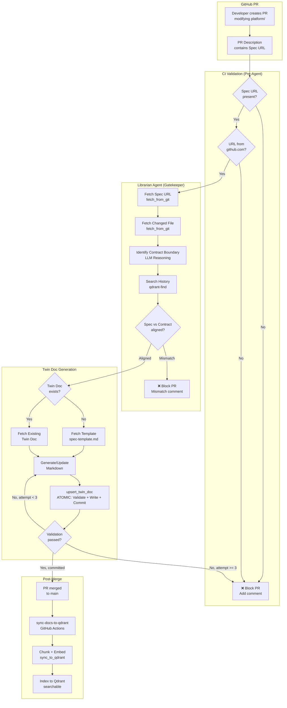

# Design Document: Twin Docs Workflow

## Overview

This design document outlines the technical implementation of the automated Twin Docs workflow. The system uses the Librarian Agent as a "Guardian of Consistency" to ensure every platform composition has an accurate, validated Twin Doc that aligns with business intent.

**Key Design Principles:**
- **Universal Mental Model**: Agent uses Triangulation (Intent, Reality, Record) and Contract Boundary identification
- **Gatekeeper Pattern**: Agent validates Spec vs Code before creating docs using architectural reasoning
- **Iteration Loop**: Agent self-corrects validation errors (max 3 attempts)
- **No Brittle Parsers**: Uses LLM reasoning to identify Contract Boundaries instead of technology-specific parsers
- **GitHub-Only Specs**: Enforce traceability via GitHub URLs
- **Surgical Updates**: Modify only changed parameters, preserve manual sections

---

## Architecture

### High-Level Flow



---

## Component Specifications

### 1. PR Template

**Purpose:** Guide developers to include Spec URL or inline specification

**File:** `.github/pull_request_template.md`

```markdown
## Description
<!-- Describe your changes -->

## Specification (Required)

**Option 1: Link to GitHub Issue/Discussion**
**Spec:** https://github.com/org/repo/issues/XXX

**Option 2: Inline Specification (for small changes)**
<!-- Use this for typo fixes, small config changes, or simple updates -->

### Business Requirements
- Requirement 1: What needs to change and why
- Requirement 2: Constraints or limits (e.g., "max 10GB storage")

### Acceptance Criteria
- [ ] Criterion 1: Specific testable outcome
- [ ] Criterion 2: Specific testable outcome

---

## Changes
- [ ] Modified platform composition
- [ ] Updated Twin Doc (auto-generated by agent)

## Checklist
- [ ] Specification provided (URL or inline)
- [ ] Code aligns with spec requirements
```

**Validation Logic:**
```python
import re

def validate_specification(pr_description):
    """
    Validate that PR contains either:
    1. GitHub URL (external spec), OR
    2. Inline specification section
    
    Returns: (is_valid, spec_source, spec_content)
    """
    # Option 1: Check for GitHub URL
    url_match = re.search(r'\*\*Spec:\*\*\s+(https://github\.com/[^\s]+)', pr_description)
    if url_match:
        url = url_match.group(1)
        if not url.startswith('https://github.com/'):
            return False, None, "❌ Spec URL must be from github.com domain"
        return True, "url", url
    
    # Option 2: Check for inline specification section
    inline_match = re.search(
        r'### Business Requirements\s*\n(.*?)\n### Acceptance Criteria',
        pr_description,
        re.DOTALL
    )
    if inline_match:
        # Extract inline spec content
        requirements = inline_match.group(1).strip()
        criteria_match = re.search(
            r'### Acceptance Criteria\s*\n(.*?)(?:\n---|$)',
            pr_description,
            re.DOTALL
        )
        if criteria_match:
            criteria = criteria_match.group(1).strip()
            inline_spec = f"# Inline Specification\n\n## Requirements\n{requirements}\n\n## Acceptance Criteria\n{criteria}"
            return True, "inline", inline_spec
    
    # Neither option provided
    return False, None, "❌ Missing specification. Provide either a GitHub URL or inline specification."
```

---

### 2. CI Workflow (Pre-Agent Validation)

**File:** `.github/workflows/twin-docs.yaml`

```yaml
name: Twin Docs Workflow

on:
  pull_request:
    paths:
      - 'platform/**/*.yaml'

jobs:
  validate-spec-url:
    runs-on: ubuntu-latest
    outputs:
      spec_url: ${{ steps.check.outputs.spec_url }}
    steps:
      - name: Check Spec URL
        id: check
        run: |
          # Extract Spec URL from PR description
          SPEC_URL=$(echo "${{ github.event.pull_request.body }}" | grep -oP '(?<=\*\*Spec:\*\*\s)https://github\.com/[^\s]+')
          
          if [ -z "$SPEC_URL" ]; then
            echo "::error::Missing GitHub Spec URL in PR description"
            gh pr comment ${{ github.event.pull_request.number }} --body "❌ **Missing GitHub Spec URL**\n\nPlease add a link to the GitHub issue/doc that describes this change."
            exit 1
          fi
          
          if [[ ! "$SPEC_URL" =~ ^https://github\.com/ ]]; then
            echo "::error::Spec URL must be from github.com"
            gh pr comment ${{ github.event.pull_request.number }} --body "❌ **Invalid Spec URL**\n\nSpec URL must be from github.com domain. Found: $SPEC_URL"
            exit 1
          fi
          
          echo "spec_url=$SPEC_URL" >> $GITHUB_OUTPUT

  invoke-agent:
    needs: validate-spec-url
    runs-on: ubuntu-latest
    steps:
      - name: Checkout
        uses: actions/checkout@v4
      
      - name: Get changed files
        id: changed
        run: |
          CHANGED_FILES=$(gh pr view ${{ github.event.pull_request.number }} --json files --jq '.files[].path' | grep '^platform/.*\.yaml$' | jq -R -s -c 'split("\n")[:-1]')
          echo "files=$CHANGED_FILES" >> $GITHUB_OUTPUT
      
      - name: Invoke Librarian Agent
        run: |
          # Call agent via API with context
          curl -X POST http://librarian-agent.intelligence.svc.cluster.local:8080/v1/chat/completions \
            -H "Content-Type: application/json" \
            -d '{
              "messages": [{
                "role": "user",
                "content": "Process PR #${{ github.event.pull_request.number }}\nSpec URL: ${{ needs.validate-spec-url.outputs.spec_url }}\nChanged files: ${{ steps.changed.outputs.files }}"
              }]
            }'
```

---

### 3. Agent System Prompt

**File:** `platform/03-intelligence/compositions/kagents/librarian/librarian-agent.yaml`

**Note:** The complete system prompt is maintained in `.kiro/specs/twin-docs-workflow/librarian-agent-prompt.md` and applied to the agent YAML configuration.

**Key Principles:**

1. **Universal Mental Model (Triangulation)**
   - Intent (The Spec): What did the business ask for?
   - Reality (The Diff): What does the code actually do?
   - Record (The Artifact): What does the documentation say?

2. **Contract Boundary Identification**
   - Agent uses LLM reasoning to identify public interfaces
   - No technology-specific parsers required
   - Works across Infrastructure (YAML), Code (Python/Go), Policy (OPA), Operations (Docs)

3. **The Gatekeeper Process**
   - Step 1: Identify Contract Boundary using architectural reasoning
   - Step 2: Compare Intent (Spec) vs Reality (Contract)
   - Step 3: Surgical Update (only if aligned)

4. **Tool Strategy**
   - `qdrant-find`: Search for similar documentation patterns
   - `fetch_from_git`: Read files from GitHub (Spec, Code, Docs)
   - `upsert_twin_doc`: Atomic validate + write + commit

5. **PR Comment Summary**
   - After successful commit, post concise PR comment
   - Summarize what was documented (not how)
   - Keep under 200 words
   - Include file path and key changes

**Contract Boundary Table:**

| File Type | Contract (Document) | Implementation (Ignore) |
|:----------|:-------------------|:------------------------|
| Infrastructure (YAML) | XRD Schema, Parameters, Validation Rules | Patches, Transforms, Resource Templates |
| Code (Python/Go) | API Routes, Function Signatures, Models | Function Bodies, Logic, Database Queries |
| Policy (OPA/Kyverno) | Rule Definitions, Conditions | Rego Implementation, Helper Functions |
| Operations (Docs) | Symptoms, Diagnosis, Resolution Steps | Anecdotes, Timestamps, Commentary |

**Validation Rules:**
- Frontmatter: Must match category schema
- No-Fluff Policy: Tables/Lists only (except Overview/Purpose)
- Filename: Kebab-case, max 3 words, no timestamps/versions
- Iteration: Max 3 attempts to fix validation errors

---

### 4. Qdrant Sync Workflow

**File:** `.github/workflows/sync-docs-to-qdrant.yaml`

```yaml
name: Sync Docs to Qdrant

on:
  push:
    branches:
      - main
    paths:
      - 'artifacts/**/*.md'

jobs:
  sync:
    runs-on: ubuntu-latest
    steps:
      - name: Checkout
        uses: actions/checkout@v4
      
      - name: Get changed files
        id: changed
        run: |
          CHANGED_FILES=$(git diff --name-only ${{ github.event.before }} ${{ github.event.after }} | grep '^artifacts/.*\.md$' | jq -R -s -c 'split("\n")[:-1]')
          echo "files=$CHANGED_FILES" >> $GITHUB_OUTPUT
      
      - name: Sync to Qdrant
        run: |
          # Call sync_to_qdrant MCP tool
          curl -X POST http://qdrant-mcp.intelligence.svc.cluster.local:8000/mcp \
            -H "Content-Type: application/json" \
            -d '{
              "method": "tools/call",
              "params": {
                "name": "sync_to_qdrant",
                "arguments": {
                  "docs_path": "artifacts/",
                  "commit_sha": "${{ github.sha }}"
                }
              }
            }'
```

---

## Data Models

### Twin Doc Frontmatter

**IMPORTANT: All artifacts/ files include auto-generated warning**

```markdown
<!-- 
⚠️ AUTOMATICALLY GENERATED - DO NOT EDIT DIRECTLY
This file is maintained by the Librarian Agent.
To update: Modify the source composition in platform/ or the spec URL.
Last generated: 2025-11-29T10:00:00Z
-->
---
schema_version: "1.0"
category: spec
resource: webservice
api_version: apis.bizmatters.io/v1alpha1
kind: XWebService
composition_file: platform/04-apis/compositions/webservice.yaml
created_at: 2025-11-25T10:00:00Z
last_updated: 2025-11-25T10:00:00Z
tags:
  - api
  - webservice
---
```

### Configuration Parameters Table

```markdown
| Parameter | Type | Required | Default | Validation | Description |
|:----------|:-----|:---------|:--------|:-----------|:------------|
| `spec.parameters.replicas` | integer | No | `1` | 1-10 | Number of pod replicas |
| `spec.parameters.storageSize` | string | No | `10Gi` | Valid k8s quantity | PVC storage size |
```

### Qdrant Payload

```json
{
  "id": "artifacts-specs-webservice-001",
  "vector": [0.1, 0.2, ...],
  "payload": {
    "file_path": "artifacts/specs/webservice.md",
    "title": "WebService API Specification",
    "category": "spec",
    "resource": "webservice",
    "last_indexed_commit": "abc123",
    "last_indexed_at": "2025-11-25T12:00:00Z",
    "section_title": "Configuration Parameters"
  }
}
```

---

## Security Considerations

### GitHub Token Permissions

**CRITICAL: Agent MUST use GitHub App Token or PAT (not default GITHUB_TOKEN)**

- **Why:** Default `GITHUB_TOKEN` does NOT trigger subsequent workflows
- **Risk:** CI re-validation (Step 4) will never run after agent commits
- **Solution:** Use GitHub App Token or Personal Access Token (PAT) with `repo` scope
- **Implementation:**
  - Store token in External Secrets Operator
  - Pass to agent via environment variable `GITHUB_BOT_TOKEN`
  - Agent uses this token for all commits via `commit_to_pr` tool

**Token Requirements:**
- **Scope:** `repo` (read/write access to code)
- **No admin permissions**
- **Commits signed with GPG key** (optional but recommended)
- **Token rotation:** Every 90 days via External Secrets Operator

### Agent RBAC

- **Read:** `platform/**`, `artifacts/**`
- **Write:** `artifacts/**` only
- **No write to:** `platform/**`, `.github/**`

### URL Validation

- **Whitelist:** `github.com` domain only
- **Prevent injection:** Parse URL, validate scheme and domain
- **No redirects:** Fetch URL directly, no follow redirects

---

## Performance Considerations

### Agent Execution Time

- **Target:** < 30 seconds per PR
- **Breakdown:**
  - Fetch Spec URL: 2s
  - Fetch Composition: 1s
  - Search Qdrant: 3s
  - Generate Twin Doc: 10s
  - Validate: 5s
  - Commit: 5s
  - Buffer: 4s

### Qdrant Sync Time

- **Target:** < 2 minutes for full `artifacts/` directory
- **Chunking:** 512 tokens, 50% overlap
- **Embedding:** OpenAI API (batch requests)
- **Indexing:** Qdrant batch upsert

---

## Testing Strategy

### Unit Tests

- Validation scripts: 100% coverage
- URL parsing: Test edge cases
- YAML parsing: Test malformed YAML

### Integration Tests

- End-to-end PR workflow
- Gatekeeper blocking scenarios
- Validation iteration loop
- Qdrant sync verification

### Acceptance Tests

- Test Case 1: Missing Spec URL → CI blocks
- Test Case 2: Non-GitHub URL → CI blocks
- Test Case 3: Spec vs Code mismatch → Agent blocks
- Test Case 4: New Twin Doc creation → Success
- Test Case 5: Twin Doc update → Only table modified
- Test Case 6: Validation error iteration → Agent fixes
- Test Case 7: Qdrant sync → Doc searchable

---

## Monitoring and Observability

### Metrics

- `twin_docs_pr_total` - Total PRs processed
- `twin_docs_blocked_total` - PRs blocked by Gatekeeper
- `twin_docs_created_total` - New Twin Docs created
- `twin_docs_updated_total` - Twin Docs updated
- `twin_docs_validation_errors_total` - Validation errors encountered
- `twin_docs_execution_seconds` - Agent execution time

### Alerts

- Agent execution time > 60s
- Validation error rate > 10%
- Gatekeeper block rate > 50%
- Qdrant sync failures

---

## Distillation Workflow Design

### Purpose

Extract operational knowledge from free-form developer notes in `docs/` and convert to structured artifacts in `artifacts/runbooks/`.

### Trigger

```yaml
on:
  pull_request:
    paths:
      - 'docs/**/*.md'
```

### Agent Distillation Logic

```python
def distill_docs(changed_files, pr_number):
    for file_path in changed_files:
        # Step 1: Read docs/ file
        content = fetch_from_git(file_path)
        
        # Step 2: Identify operational knowledge
        if not is_operational_knowledge(content):
            comment_on_pr("No operational knowledge found in {file_path}")
            continue
        
        # Step 3: Search for similar artifacts
        similar = qdrant_find(f"similar to {extract_topic(content)}")
        
        # Step 4: Update or create
        if similar and similar[0].score > 0.85:
            # Update existing artifact
            existing_path = similar[0].payload['file_path']
            existing_content = fetch_from_git(existing_path)
            updated_content = merge_knowledge(existing_content, content)
            upsert_twin_doc(existing_path, updated_content, pr_number, 
                          "docs: update runbook with additional info")
        else:
            # Create new artifact
            artifact_path = generate_artifact_path(file_path)
            template = fetch_from_git("artifacts/templates/runbook-template.md")
            structured_content = fill_template(template, content)
            upsert_twin_doc(artifact_path, structured_content, pr_number,
                          "docs: distill runbook from docs/")
        
        # Step 5: Original docs/ file remains unchanged
        # Agent does NOT modify docs/ files
```

### Runbook Template Structure

```markdown
---
schema_version: "1.0"
category: runbook
severity: high | medium | low
affected_services:
  - postgres
  - dragonfly
created_at: 2025-11-25T10:00:00Z
last_updated: 2025-11-25T10:00:00Z
tags:
  - database
  - disk
  - troubleshooting
---

# Postgres Disk Issue

## Symptoms

- Disk usage at 95%
- Slow query performance
- Connection timeouts

## Diagnosis Steps

1. Check disk usage: `df -h`
2. Identify large tables: `SELECT pg_size_pretty(pg_total_relation_size('table_name'))`
3. Check WAL files: `ls -lh /var/lib/postgresql/data/pg_wal/`

## Resolution

1. Archive old WAL files
2. Vacuum large tables: `VACUUM FULL table_name`
3. Increase disk size if needed

## Prevention

- Set up disk usage alerts at 80%
- Configure WAL archiving
- Schedule regular vacuum jobs
```

### Duplicate Detection Logic

```python
def detect_duplicate(content):
    # Extract key topics/entities
    topics = extract_topics(content)  # e.g., ["postgres", "disk", "issue"]
    
    # Search Qdrant
    query = f"runbook about {' '.join(topics)}"
    results = qdrant_find(query, limit=5)
    
    # Check similarity threshold
    for result in results:
        if result.score > 0.85:
            return result.payload['file_path']
    
    return None
```

---

## Core Cognitive Process: Triangulation

Instead of using brittle parsers, the Agent uses a **Universal Mental Model** to process changes:

1. **Intent (The Spec):** Fetched from GitHub Issue/PR Body
2. **Reality (The Code):** Fetched from Git. Agent applies "Contract Boundary" reasoning to filter noise
3. **Record (The Doc):** Fetched from Git

**The "Contract Boundary" Logic:**

The Agent is explicitly instructed to ignore "internals" (function bodies, patch logic) and focus solely on "interfaces" (schemas, signatures, configurations).

**Why this scales:**
- Works for Crossplane (YAML)
- Works for Agent Executor (Python)
- Works for Policies (Rego)
- No code changes needed to support new languages; only Prompt updates

---

## Rollout Plan

### Phase 1: Foundation (Week 1)
- Create PR template
- Enhance validation scripts
- Create test composition

### Phase 2: MCP Tools (Week 1)
- Create upsert_twin_doc MCP tool (atomic validate + write + commit)
- No parsing tools needed - uses LLM reasoning

### Phase 3: CI Integration (Week 2)
- Create twin-docs.yaml workflow
- Test end-to-end with test composition
- Fix issues

### Phase 4: Agent Enhancement - Universal Mental Model (Week 2-3)
- Update agent system prompt with Triangulation approach
- Embed Contract Boundary identification logic
- Test Gatekeeper logic with architectural reasoning
- Test iteration loop

### Phase 5: Validation Iteration (Week 3)
- Test validation error handling
- Test historical precedent search
- Verify max retry enforcement
- Test Contract Boundary identification across file types

### Phase 6: Qdrant Sync (Week 3)
- Create sync-docs-to-qdrant.yaml workflow
- Test indexing
- Verify search works

### Phase 7: Production (Week 4)
- Enable for all platform resources
- Monitor metrics
- Iterate on feedback

### Phase 8: Distillation (Week 4)
- Add distillation mode to CI workflow
- Create runbook template
- Test distillation with sample docs/
- Test duplicate detection
- Enable for all docs/ changes

---

## Success Criteria

1. ✅ 100% of PRs have valid GitHub Spec URLs
2. ✅ 100% of Spec vs Code mismatches detected
3. ✅ 100% of Twin Docs pass validation
4. ✅ < 30 seconds agent execution time
5. ✅ 100% of merged Twin Docs indexed in Qdrant
6. ✅ 0% false positives

---

## References

- Requirements: `.kiro/specs/twin-docs-workflow/requirements.md`
- Tasks: `.kiro/specs/twin-docs-workflow/tasks.md`
- Intelligence Layer Design: `.kiro/specs/intelligence-layer/design.md`
