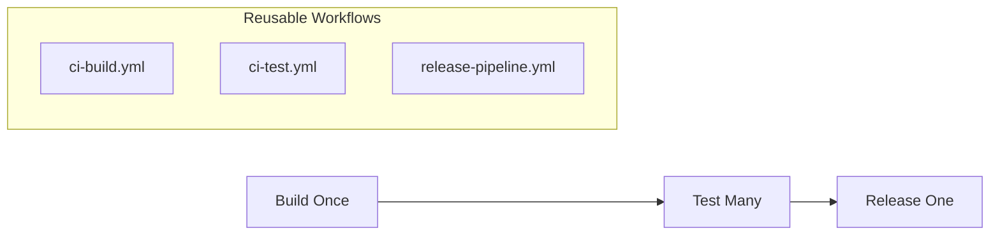

# CI Workflow Guide: "Build Once, Validate Many, Release One"

## Architecture

**Problem Solved**: Each test building separate images, artifact drift, monolithic workflows

**Solution**: 3-stage reusable workflows with artifact reuse



## Workflow Integration

### Service Implementation Pattern
Services create **single orchestration workflow** (`.github/workflows/main-pipeline.yml`):

```yaml
jobs:
  # STAGE 1: Build artifact once
  build:
    uses: arun4infra/zerotouch-platform/.github/workflows/ci-build.yml@main
    
  # STAGE 2: Parallel tests using same artifact  
  test-nats:
    needs: build
    uses: arun4infra/zerotouch-platform/.github/workflows/ci-test.yml@main
    with:
      image_tag: ${{ needs.build.outputs.image_tag }}
      test_suite: "tests/integration/nats"
      
  test-api:
    needs: build  
    uses: arun4infra/zerotouch-platform/.github/workflows/ci-test.yml@main
    with:
      image_tag: ${{ needs.build.outputs.image_tag }}
      test_suite: "tests/integration/api"
      
  # STAGE 3: Release only if ALL tests pass
  release:
    needs: [build, test-nats, test-api]
    if: github.ref == 'refs/heads/main'
    uses: arun4infra/zerotouch-platform/.github/workflows/release-pipeline.yml@main
    with:
      image_tag: ${{ needs.build.outputs.image_tag }}
```

## Artifact-Aware Testing

### ci-test.yml Integration
- Accepts `image_tag` input from build job
- Pulls pre-built image: `docker pull ${{ inputs.image_tag }}`
- Sets `OVERRIDE_IMAGE_TAG` environment variable
- Calls `in-cluster-test.sh` with artifact awareness

### Bootstrap Script Integration
`in-cluster-test.sh` detects `OVERRIDE_IMAGE_TAG` and:
- **Skips local build** when artifact provided
- **Uses pre-built image** for Kind cluster
- **Patches manifests** with correct image tag
- **Deploys exact tested artifact**

## Service Configuration

### Filesystem Contract
Services declare requirements in `ci/config.yaml`:

```yaml
service:
  name: "my-service"
  namespace: "intelligence-myservice"
  
dependencies:
  platform: [cnpg-operator, external-secrets]
  external: [deepagents-runtime]  
  internal: [postgres, redis]
  
env:
  USE_MOCK_LLM: "true"
  LOG_LEVEL: "debug"
```

### Platform Execution
Platform handles all complexity:
1. **Platform Readiness**: Validates required components exist
2. **External Dependencies**: Deploys dependent services first
3. **Service Deployment**: Builds/patches/deploys service
4. **Internal Validation**: Tests service infrastructure

## Build System Evolution

### Old Pattern (Deprecated)
```yaml
# Multiple workflows, each building separately
nats-tests.yml    # Builds image, runs NATS tests
api-tests.yml     # Builds image, runs API tests
release.yml       # Builds image, deploys
```

### New Pattern (Current)
```yaml
# Single orchestration workflow
main-pipeline.yml # Build once → Test many → Release one
```

## Benefits

**Build Efficiency**:
- 1 build instead of N builds (N = test suites)
- Parallel tests using pre-built image
- Consistent artifacts across pipeline

**Test Visibility**:
- Granular failures (separate job per test suite)
- Parallel execution for speed
- Focused logs per test type

**Deployment Safety**:
- Exact tested image deployed
- All tests must pass gate
- Clear audit trail

## Migration Path

1. **Copy template**: Use `scripts/release/template/example-tenant-workflow.yml`
2. **Add test jobs**: One job per test suite
3. **Configure secrets**: GitHub tokens, AWS credentials
4. **Setup environments**: Create staging/production with approvers
5. **Archive old workflows**: Move to `archived/` directory

Platform handles complexity, services focus on business logic.