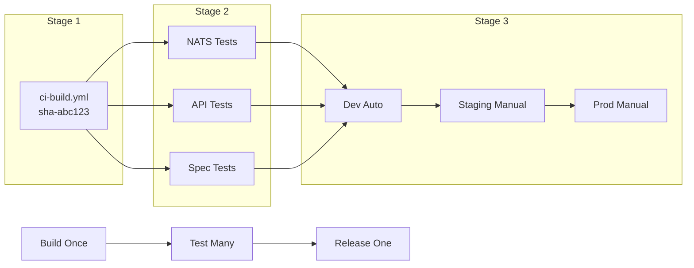

# Release Pipeline: "Build Once, Validate Many, Release One"

## Architecture

**3-Stage Flow:**
1. **Build**: Create SHA-tagged image once (`ghcr.io/org/service:sha-abc123`)
2. **Validate**: Run parallel tests using same image
3. **Release**: Deploy validated image through environments



## Workflows

### ci-build.yml
- Builds image once with `sha-<commit>` tag
- Pushes to registry
- Outputs `image_tag` for downstream jobs

### ci-test.yml  
- Accepts `image_tag` input from build stage
- Pulls pre-built image for testing
- Runs specific test suite in ephemeral Kind cluster
- Uses `deploy.sh` to apply platform claims directly (simulates GitOps)
- Replaces hardcoded image tags with CI-built tag before deployment

### release-pipeline.yml
- Deploys validated image through environments using GitOps
- **Dev**: Automatic deployment after all tests pass
- **Staging/Prod**: GitHub Environment gates (manual approval)
- Uses `deploy-direct.sh` to update tenant repository (production GitOps)
- Different from CI testing which uses `deploy.sh` for direct platform claims

## GitOps Flow

**Production Releases** use `deploy-direct.sh` for tenant repository updates:
```bash
# Updates kustomization.yaml in tenant repo
tenants/${SERVICE}/overlays/${ENV}/kustomization.yaml
newTag: "sha-abc123"

# Direct Git commit (no PRs)
git commit -m "Deploy ${SERVICE} to ${ENV}"
git push origin main

# ArgoCD auto-syncs changes
```

**CI Testing** uses `deploy.sh` for direct platform deployment:
```bash
# Updates platform claims with CI-built image tag
sed -i "s|image: .*|image: ${IMAGE_TAG}|g" platform/claims/
kubectl apply -f platform/claims/ --recursive
```

## GitHub Environment Gates

**Setup** (one-time per service):
1. Go to service repo Settings > Environments
2. Create `staging` and `production` environments  
3. Enable "Required Reviewers"
4. Assign approvers (QA, SRE teams)

**Behavior**:
- **Dev**: Deploys automatically after tests pass
- **Staging**: Pauses for manual approval via GitHub UI
- **Production**: Pauses for manual approval after staging

## Service Implementation

Copy template to service repo as `.github/workflows/main-pipeline.yml`:

```yaml
jobs:
  build:
    uses: arun4infra/zerotouch-platform/.github/workflows/ci-build.yml@main
    
  test-nats:
    needs: build
    uses: arun4infra/zerotouch-platform/.github/workflows/ci-test.yml@main
    with:
      image_tag: ${{ needs.build.outputs.image_tag }}
      test_suite: "tests/integration/nats"
      
  release:
    needs: [build, test-nats]  # ALL tests must pass
    if: github.ref == 'refs/heads/main'
    uses: arun4infra/zerotouch-platform/.github/workflows/release-pipeline.yml@main
    with:
      image_tag: ${{ needs.build.outputs.image_tag }}  # Same tested image
```

## Benefits

- **Artifact Consistency**: Same image tested and deployed
- **Parallel Testing**: Faster CI with granular failure visibility  
- **Native Gates**: GitHub UI approvals with audit trail
- **GitOps Compliance**: All deployments via Git commits
- **90% Code Reduction**: From 2000+ lines to ~300 lines